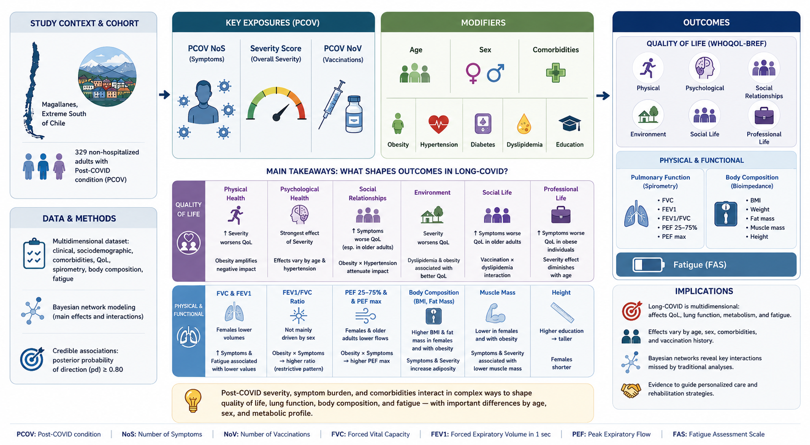

```{r}
#| label: setup
#| include: false

library(data.table)
library(knitr)
library(kableExtra)
library(ggplot2)
library(scales)

# ── Helper: parse credible interval bounds from "[lower, upper]" strings ──
parse_ci <- function(dt) {
  dt <- copy(dt)
  dt[, ci_lower := as.numeric(sub("\\[([^,]+),.*",    "\\1", ci))]
  dt[, ci_upper := as.numeric(sub(".*,\\s*([^]]+)\\]","\\1", ci))]
  dt
}

# Load model summaries
all_params  <- fread("../output/model_summaries.csv")
signif_params <- fread("../output/model_summaries_signif.csv")

all_params    <- parse_ci(all_params)
signif_params <- parse_ci(signif_params)

# ── Response → primary domain lookup (used by both figures) ───────────────
psych_resp <- c("BAI score","BDI score","Pittsburg score","WAISS score")
qol_resp   <- c("QoL: Caretakers","QoL: Family life","QoL: Social life",
                "QoL: Profesional life","QoL: Mental health","QoL: Personal activities")
phys_resp  <- c("FEV1","FVC","Ratio FEV1/FVC","PEF 25-75%","PEF max",
                "BMI","Fat mass","Muscle mass","Weight","Height")

domain_levels <- c("Psychological","Quality of Life",
                   "Physical and Functional","Laboratory and Cellular")

domain_palette <- c(
  "Psychological"           = "#2C6FAC",
  "Quality of Life"         = "#E07B2E",
  "Physical and Functional" = "#3A8C4E",
  "Laboratory and Cellular" = "#B03A3A"
)

assign_domain <- function(resp) {
  data.table::fcase(
    resp %in% psych_resp, "Psychological",
    resp %in% qol_resp,   "Quality of Life",
    resp %in% phys_resp,  "Physical and Functional",
    default = "Laboratory and Cellular"
  )
}

# Helper: retrieve a single label for inline reporting
get_label <- function(data = all_params, area_val, response_val, var_val) {
  row <- data[area == area_val & response == response_val & var == var_val]
  if (nrow(row) == 0) return("[result not found]")
  row$label[1]
}

# Helper: make a compact results table for a given area/response combo
make_table <- function(data = signif_params, area_val, response_val,
                       caption = NULL) {
  dt <- data[area == area_val & response == response_val,
             .(Predictor = var, Estimate = estimate, `95% CI` = ci,
               pd, ps, `BF~10~` = bf)]
  if (nrow(dt) == 0) return(invisible(NULL))
  kable(dt, digits = 2, caption = caption,
        col.names = c("Predictor", "β", "95% CI", "pd", "ps", "BF₁₀")) |>
    kable_styling(bootstrap_options = c("striped", "hover", "condensed"),
                  full_width = FALSE, font_size = 11)
}

# Helper: multi-response table for an entire area
make_area_table <- function(data = signif_params, area_val,
                             caption = NULL) {
  dt <- data[area == area_val,
             .(Outcome = response, Predictor = var,
               β = estimate, `95% CI` = ci,
               pd, ps, BF10 = bf)]
  setorder(dt, Outcome, -pd)
  kable(dt, digits = 2, caption = caption) |>
    kable_styling(bootstrap_options = c("striped", "hover", "condensed"),
                  full_width = TRUE, font_size = 10) |>
    collapse_rows(columns = 1, valign = "top")
}

# Convenience: extract scalar values
get_est <- function(data = all_params, area_val, response_val, var_val) {
  row <- data[area == area_val & response == response_val & var == var_val]
  if (nrow(row) == 0) return(NA_real_)
  row$estimate[1]
}
get_pd <- function(data = all_params, area_val, response_val, var_val) {
  row <- data[area == area_val & response == response_val & var == var_val]
  if (nrow(row) == 0) return(NA_real_)
  row$pd[1]
}
```

# Overview

```{r counts}
#| include: false
n_total    <- nrow(all_params)
n_signif   <- nrow(signif_params)
n_domains  <- length(unique(all_params$area))
n_outcomes <- length(unique(all_params$response))
n_lab_resp <- length(unique(all_params[area == "Laboratory and Cellular", response]))
```

The findings collectively characterise the multidomain health consequences of Long COVID (PCOV) in the Magallanes region of Chilean Patagonia, and reveal three overarching patterns that cut across all four domains. First, the PCOV Severity Score, a composite index of functional impairment and symptom impact, emerged as the most consistent and broadly acting predictor of adverse health outcomes, showing credible directional associations (pd ≥ 0.80) with outcomes spanning depressive symptomatology, anxiety, quality of life across all six self-reported dimensions, pulmonary function, body composition, hepatic enzyme activity, glycaemic regulation, and circulating lymphocyte subsets. By contrast, PCOV NoS (the raw count of persistent symptoms) showed a more heterogeneous pattern, often pointing in the opposite direction to the Severity Score for the same outcome, most notably for BMI, fat mass, platelet counts, and transaminases, a divergence that suggests these two PCOV metrics capture qualitatively distinct axes of disease burden: the NoS reflecting breadth of symptom involvement, and the Severity Score reflecting functional depth and systemic impact. Second, the primary PCOV associations were rarely homogeneous across the population; instead, they were systematically and substantially modulated by comorbidity status (obesity, diabetes mellitus, arterial hypertension, and dyslipidaemia), sex, age, fatigue severity, and educational attainment, producing interaction effects that in several instances far exceeded the main effects in both magnitude and statistical support. Third, biological sex exerted pervasive influence as a background factor throughout the Physical and Functional and Laboratory and Cellular domains, dominating spirometric volumes, body composition, hepatic enzymes, renal markers, and lymphocyte subset counts, underscoring the necessity of sex-stratified analysis in PCOV research.

{width=100%}
: Graphical abstract. Tentative figure done with ChatGPT. Final figure must be discussed.

Within the **Psychological domain**, the PCOV Severity Score showed strong positive associations with both depressive (BDI) and anxiety (BAI) symptom burden. The most exceptional single finding in this domain was the interaction between PCOV Severity Score and obesity for cognitive performance (WAISS score; BF~10~ = 44.04, pd = 100%), representing overwhelming Bayesian evidence that among obese participants, greater PCOV severity was associated with substantially higher cognitive scores, a counterintuitive result whose interpretation warrants prospective examination, but which stands as the most robustly supported association in the psychological domain. Hypertension and dyslipidaemia emerged as consistent moderators of PCOV–anxiety relationships, while metabolic comorbidities (particularly diabetes) modulated the PCOV–sleep quality association in a subgroup-specific pattern that diverged from the main-effect null results for the Pittsburgh Sleep Quality Index.

Within the **Quality of Life domain**, the PCOV Severity Score was again the primary driver of self-reported impairment across all six dimensions (caretaking, family life, social life, professional life, mental health, and personal activities), with effects predominantly positive and generally moderate in magnitude (β ranging from approximately 0.2 to 0.5 SD). Obesity consistently emerged as the most influential comorbidity moderator: the interaction between PCOV NoS and obesity for family life QoL was particularly well-supported (BF~10~ = 7.24), and obesity moderated severity associations for social life, professional life, mental health, and personal activities as well. A cross-cutting pattern of sex-differentiated associations with vaccination count (PCOV NoV) was identified across multiple QoL dimensions, most notably for caretaking and social life, in which higher NoV was associated with worse QoL specifically in women.

Within the **Physical and Functional domain**, female sex was the dominant factor of all absolute spirometric indices (FVC, FEV1, PEF 25–75%, and PEF max), with Bayes Factors exceeding 379 for FEV1 and 16,000 for FVC, consistent with established sex differences in lung volumes. Beyond this structural baseline, fatigue scale scores showed credible negative associations with FVC, FEV1, and PEF, indicating that PCOV-associated fatigue burden extends to measurable reductions in ventilatory capacity in the Magallanes cohort. PCOV NoS showed a credible negative main effect on FVC, attenuated among women. Body composition outcomes echoed the opposing directionality between PCOV NoS and Severity Score seen in other domains: the Severity Score was negatively associated with BMI and fat mass, while PCOV NoS showed positive associations with both, consistent with a model in which high-symptom-count PCOV (without high functional severity) may accompany preserved or increased adiposity, whereas severe functional PCOV is associated with weight loss and reduced fat stores. Fatigue interacted with both PCOV Severity Score and PCOV NoV for BMI, amplifying these associations in the most fatigued participants.

Within the **Laboratory and Cellular domain**, the most expansive section of the analysis, encompassing `r n_lab_resp` biomarkers across haematology, hepatic and protein profiles, renal function, metabolic biochemistry, lymphocyte immunophenotyping, and age-associated B cells, several headline findings of exceptional statistical strength were identified. The education-level interactions with hepatic enzyme associations (GPT and transaminases) produced the largest Bayes Factors in the entire dataset, exceeding BF~10~ > 46,000 for the GPT × PCOV NoV × education (linear) interaction, indicating that the relationship between PCOV burden and hepatic stress is profoundly and non-linearly shaped by sociodemographic context, likely mediated through education-correlated behavioural and metabolic pathways. For glycaemic regulation, the PCOV NoV × diabetes interaction for fasting glucose was the second largest finding (BF~10~ = 102.8), with diabetic participants showing substantially lower glucose levels at higher vaccination counts, a result consistent with differential healthcare engagement in better-managed patients with diabetes. For the immune compartment, PCOV Severity Score showed a strong negative main effect on circulating CD3+ T lymphocytes (BF~10~ = 1.05), consistent with T lymphopenia as a feature of PCOV immune dysregulation, while the interaction between PCOV NoS and obesity was robustly positive for both total CD3+ and CD4+ T cells, suggesting an amplified lymphocyte response at the intersection of obesity and high symptom burden. Triglyceride levels showed a particularly prominent interaction between PCOV Severity Score and obesity (BF~10~ = 12.18), adding to a pattern of compounded metabolic dysregulation in obese participants with severe PCOV.

Taken together, these results paint a coherent but complex picture: Long COVID in Magallanes exerts a broad, multidomain impact that is not reducible to a single biomarker or clinical dimension, and whose magnitude and direction are fundamentally contingent on the metabolic, demographic, and socioeconomic context of the individual. The PCOV Severity Score, fatigue burden, obesity, and educational attainment stand out as the most influential axes of heterogeneity, and their interactions with PCOV metrics define the highest-priority targets for subgroup-stratified intervention and longitudinal follow-up in this population.

# Statistical Methods {#sec-methods}

## Bayesian Multivariate Regression Models

All statistical analyses were conducted within a Bayesian framework using multivariate Gaussian regression models fitted with the brms package [@burkner2017] (version ≥ 2.20), which interfaces with the probabilistic programming language Stan [@carpenter2017] via the rstan backend. Data were standardised prior to modelling using the datawizard package [@patil2022], centering each variable at its mean and scaling by its standard deviation, so that all regression coefficients ($\beta$) are expressed in units of standard deviations and are directly comparable across outcomes.

### Model Specification

Health outcomes were grouped into four thematic domains: (1) Psychological, (2) Quality of Life, (3) Physical and Functional, and (4) Laboratory and Cellular; and a separate multivariate model was fitted for each sub-group of outcomes within those domains. Grouping outcomes within the same model allowed the residual correlation structure among conceptually related measures to be estimated jointly, improving efficiency and coherence of inference [@burkner2018].

Within each model, every outcome $y_{ij}$ (outcome $j$ for individual $i$) was jointly regressed on three primary factors of Prolonged-COVID (PCOV) disease burden: 1) PCOV NoS, the total number of long-COVID symptoms reported by the participant; 2) PCOV Severity Score, a composite index capturing the overall severity and functional impact of long-COVID across multiple dimensions; 3) PCOV NoV, the total number of COVID-19 vaccine doses received.

Each primary factor was fully crossed (two-way interaction) with the following set of covariates: 1) Age (continuous, standardised); 2) Sex (binary: male/female); 3) Education level (ordinal, decomposed into linear, quadratic, and cubic contrasts); 4) Fatigue scale (the Fatigue Assessment Scale, standardised); 5) Chronic pathologies: presence of diabetes mellitus, arterial hypertension, dyslipidaemia, and/or obesity (each binary, yes/no). Missing outcome values were handled using the missing-at-random (MAR) imputation approach integrating over the posterior distribution of missing observations during
sampling rather than discarding incomplete cases [@burkner2021].

### Prior Distributions

Weakly informative priors were specified for all parameters:

$$
\beta_k \sim \mathcal{N}(0, 3), \quad
\alpha_j \sim \mathcal{N}^+(0, 3), \quad
\sigma_j \sim \mathcal{N}^+(0, 3), \quad
\mathbf{R} \sim \text{LKJ}(2)
$$

where $\beta_k$ denotes the regression coefficients, $\alpha_j$ the outcome-specific intercepts, $\sigma_j$ the residual standard deviations, and $\mathbf{R}$ the residual correlation matrix among outcomes within each model. The LKJ(2) prior regularizes the correlation matrix towards the identity, penalizing implausibly large residual correlations [@lewandowski2009].

### Markov Chain Monte Carlo Sampling

Each model was sampled using four independent Hamiltonian Monte Carlo chains, each running for 5,000 iterations with the first 2,500 discarded as warm-up, yielding 10,000 post-warmup draws per parameter.  Sampler settings were tightened to minimize divergent transitions and ensure thorough exploration of the posterior in the presence of high-dimensional parameter spaces.  Convergence was assessed using the potential scale reduction factor ($\hat{R}$; target $\leq$ 1.01) and effective sample size (ESS; target $\geq$ 1,000 per parameter).  All models passed these diagnostics.

### Reporting of Posterior Summaries

For each model parameter, we report: $\beta$, the posterior mean (in standardized units); 95% CI, the 95% credible interval (equal-tailed); pd, the probability of direction, defined as the proportion of posterior draws sharing the sign of the posterior mean, ranging from 0.5 (no evidence of a direction) to 1.0 (complete certainty about direction) [@makowski2019]; ps, the probability of significance, operationalized as the probability that the parameter lies outside the region of practical equivalence (ROPE) defined as $[-0.1\sigma,\, 0.1\sigma]$ on the standardized scale; BF~10~, the Bayes Factor comparing the two-sided hypothesis of an effect ($\beta \neq 0$) against the null ($\beta = 0$), estimated via the Savage-Dickey density ratio [@wagenmakers2010].

Parameters with pd $\geq$ 0.80 are considered to show credible directional evidence and are highlighted in the results. This threshold corresponds approximately to the 80th percentile of the posterior mass on one side, which under a symmetric $\mathcal{N}(0,3)$ prior implies a moderate-to-strong departure from zero. Results with BF~10~ $\geq$ 1 (i.e., data at least as likely under $H_1$ as under $H_0$) are flagged as providing at least anecdotal Bayesian evidence for an effect [@jeffreys1961].  The complete set of 2,236 posterior summaries is available in the supplementary data (`model_summaries.csv`); the 803 summaries meeting the pd $\geq$ 0.80 criterion are provided in `model_summaries_signif.csv`.

All analyses were conducted in R (version ≥ 4.3.0; @rcoreteam2024). Model code and derived datasets are provided as supplementary materials.

# Results {#sec-results}

Across the four health domains, a total of `r n_outcomes` distinct outcome variables were analysed through `r n_domains` multivariate Bayesian models, generating `r n_total` posterior summaries.  Of these, `r n_signif` parameters (approximately `r round(n_signif/n_total*100)`%) met the credibility threshold of pd $\geq$ 0.80, indicating directional evidence in the Magallanes PCOV cohort.

```{r}
#| label: fig-overview
#| fig-cap: "**Overview of posterior effects of the four primary long-COVID factors across all 52 outcomes.** Colour encodes the posterior mean $\\beta$ in standardised units (blue = negative association; red = positive association). Fully saturated tiles indicate parameters meeting the credibility threshold (pd ≥ 0.80); faded tiles represent parameters below that threshold. Outcomes are grouped by health domain and sorted within each domain by mean pd. All 208 variable–outcome combinations are displayed."
#| fig-width: 8
#| fig-height: 10
#| fig-dpi: 400
#| fig-pos: "H"

main_vars  <- c("[PCOV NoS]","[PCOV Severity Score]","[PCOV NoV]","[Fatigue scale]")
var_labels <- c("PCOV\nNoS","PCOV\nSeverity\nScore","PCOV\nNoV","Fatigue\nScale")

fig1_dat <- all_params[var %in% main_vars,
                        .(area, response, var, estimate, pd, ci)]
fig1_dat[, primary_domain := assign_domain(response)]
fig1_dat[, signif := pd >= 0.80]

# Deduplicate: one row per (response, var), keeping highest pd
setorder(fig1_dat, response, var, -pd)
fig1_dat <- unique(fig1_dat, by = c("response","var"))

# Clamp extreme estimates for colour scale legibility
fig1_dat[, est_clamped := pmin(pmax(estimate, -3), 3)]

# Factor ordering: domain first, then mean pd within domain
resp_ord <- fig1_dat[, .(domain = primary_domain[1],
                          mean_pd = mean(pd, na.rm = TRUE)), by = response]
setorder(resp_ord, domain, mean_pd)
fig1_dat[, response := factor(response, levels = resp_ord$response)]
fig1_dat[, var_f    := factor(var, levels = main_vars, labels = var_labels)]
fig1_dat[, primary_domain := factor(primary_domain, levels = domain_levels)]

ggplot(fig1_dat, aes(x = var_f, y = response)) +
  # Non-significant tiles: faded
  geom_tile(data = fig1_dat[signif == FALSE],
            aes(fill = est_clamped),
            alpha = 0.22, color = "white", linewidth = 0.25) +
  # Significant tiles: fully opaque
  geom_tile(data = fig1_dat[signif == TRUE],
            aes(fill = est_clamped),
            alpha = 1.00, color = "white", linewidth = 0.25) +
  # Small marker on significant tiles
  geom_point(data = fig1_dat[signif == TRUE],
             color = "grey15", size = 0.55, alpha = 0.7, shape = 16) +
  scale_fill_gradient2(
    low      = "#2166AC",
    mid      = "#F5F5F5",
    high     = "#C0392B",
    midpoint = 0,
    limits   = c(-3, 3),
    oob      = scales::squish,
    name     = "β (std.)",
    guide    = guide_colorbar(
      barheight = unit(9, "lines"),
      barwidth  = unit(0.7, "lines"),
      title.position = "top",
      title.hjust    = 0.5,
      ticks.colour   = "grey30"
    )
  ) +
  facet_grid(primary_domain ~ .,
             scales   = "free_y",
             space    = "free_y",
             labeller = labeller(primary_domain = label_wrap_gen(14))) +
  labs(
    title    = "Long-COVID Burden Indicators: Posterior Effect Estimates Across All Health Outcomes",
    subtitle = paste0("Colour = posterior mean \u03b2 (standardised). Saturated tiles: pd \u2265 0.80; ",
                      "faded tiles: pd < 0.80. \u03b2 clamped at \u00b13 SD."),
    x        = NULL,
    y        = NULL,
    caption  = "n = 208 variable\u2013outcome associations across 52 outcomes and 4 independent variables."
  ) +
  theme_minimal(base_size = 12) +
  theme(
    strip.text.y     = element_text(size = 8, face = "bold",
                                    angle = 0, hjust = 0, vjust = 0.5),
    axis.text.y      = element_text(size = 6.8,  color = "grey20"),
    axis.text.x      = element_text(size = 9.5,  face = "bold", color = "grey10"),
    panel.grid       = element_blank(),
    legend.position  = "right",
    legend.title     = element_text(size = 8.5, face = "bold"),
    legend.text      = element_text(size = 7.5),
    plot.title       = element_text(size = 11, face = "bold",  margin = margin(b = 4)),
    plot.subtitle    = element_text(size  = 8, color = "grey40", lineheight = 1.35,
                                    margin = margin(b = 8)),
    plot.caption     = element_text(size  = 7, color = "grey55", hjust = 0),
    strip.background = element_rect(fill = "grey93", color = NA),
    panel.border     = element_rect(fill = NA, color = "grey78", linewidth = 0.4),
    plot.background  = element_rect(fill = "white",  color = NA),
    plot.margin      = margin(12, 18, 10, 8)
  )
```


## Psychological Domain {#sec-psych}

```{r psych-setup}
#| include: false
psych_sig <- signif_params[area == "Psychological"]
psych_all <- all_params[area == "Psychological"]

# Shortcut label function for this area
pl <- function(resp, var) get_label(all_params, "Psychological", resp, var)

n_psych_sig  <- nrow(psych_sig)
n_psych_resp <- length(unique(psych_sig$response))
```

The psychological domain encompassed four validated instruments: the Beck Depression Inventory (BDI), the Beck Anxiety Inventory (BAI), the Pittsburgh Sleep Quality Index (Pittsburgh score), and the Wechsler Adult Intelligence Scale (WAISS).  These were modelled jointly as multivariate outcomes, capturing their residual correlations.  Across the four instruments, `r n_psych_sig` parameters met the pd ≥ 0.80 credibility threshold, spanning main effects of PCOV burden and a rich pattern of interactions with sex, age, and comorbidities.

### Beck Depression Inventory (BDI)

The PCOV Severity Score showed the strongest and most consistent association with depressive symptomatology.  In participants from Magallanes, higher severity scores were associated with substantially elevated BDI scores (`r pl("BDI score","[PCOV Severity Score]")`), with a Bayes Factor exceeding 13, representing strong Bayesian evidence for this association.  Strikingly, the number of long-COVID symptoms (PCOV NoS) showed a negative main-effect association with BDI at the reference level of the model (`r pl("BDI score","[PCOV NoS]")`).  This seemingly counterintuitive direction reflects the estimated effect among participants at the reference category of all modifiers (male, no comorbidities, average age and education), and must be interpreted in light of the significant interactions described below, which substantially alter this relationship across subgroups.  The number of vaccines (PCOV NoV) did not show credible directional association with BDI (`r pl("BDI score","[PCOV NoV]")`).

Among demographic covariates, female sex was associated with slightly lower BDI scores at the main-effect level ($\beta$ = −0.17, pd = 92.4%), and older age with marginally lower BDI ($\beta$ = −0.08, pd = 86.7%).  The presence of diabetes mellitus was associated with higher BDI ($\beta$ = 0.19, pd = 84.7%).

The interaction between PCOV NoS and sex showed that the symptom-count effect on depression differed by sex: the negative main effect of NoS on BDI was attenuated, or partially reversed, among female participants (`r pl("BDI score","[PCOV NoS] x [Sex: Female]")`). Conversely, the severity score effect was more pronounced in male participants, with the association with BDI being significantly smaller in women (`r pl("BDI score","[PCOV Severity Score] x [Sex: Female]")`). An interaction between PCOV NoS and diabetes was also observed (`r pl("BDI score","[PCOV NoS] x [Pathologies: Diabetes (Yes)]")`), suggesting that among individuals with diabetes, the relationship between symptom burden and depression may be partially moderated by the metabolic condition.  A weaker interaction between PCOV Severity Score and hypertension was also noted (`r pl("BDI score","[PCOV Severity Score] x [Pathologies: Hypertension (Yes)]")`).

### Beck Anxiety Inventory (BAI)

Higher PCOV Severity Score was associated with elevated anxiety symptom burden in the Magallanes cohort (`r pl("BAI score","[PCOV Severity Score]")`).  By contrast, the main-effect associations of PCOV NoS (`r pl("BAI score","[PCOV NoS]")`) and PCOV NoV (`r pl("BAI score","[PCOV NoV]")`) with BAI did not reach the credibility threshold as isolated main effects, indicating that their relationship with anxiety is primarily expressed through interactions with other participant characteristics.

Among comorbidities, all three metabolic conditions showed credible positive main-effect associations with BAI: dyslipidaemia ($\beta$ = 0.34, pd = 91.6%), diabetes ($\beta$ = 0.24, pd = 87.2%), and hypertension ($\beta$ = 0.19, pd = 88.5%).  Older age showed a small negative association with baseline anxiety ($\beta$ = −0.07, pd = 82.0%).

The most prominent interaction in the psychological domain involved the modulation of the PCOV NoS effect on anxiety by hypertension status: `r pl("BAI score","[PCOV NoS] x [Pathologies: Hypertension (Yes)]")`. This strong negative interaction (BF~10~ = 5.41) indicates that among hypertensive participants, a higher number of long-COVID symptoms was associated with considerably lower BAI scores relative to non-hypertensive participants, a pattern that may reflect differential clinical follow-up, coping resources, or medical management in comorbid populations.  A similar, weaker pattern was observed with dyslipidaemia (`r pl("BAI score","[PCOV NoS] x [Pathologies: Dyslipidemia (Yes)]")`).

Age additionally moderated both the NoS and NoV associations with anxiety. The PCOV NoS × Age interaction suggested increasing anxiety with the intersection of symptom burden and older age (`r pl("BAI score","[PCOV NoS] x [Age]")`), while a similarly directed interaction emerged between vaccination count and age (`r pl("BAI score","[PCOV NoV] x [Age]")`), which may partly reflect differential vaccination experiences across age strata.  A positive interaction between PCOV Severity Score and dyslipidaemia status was also observed (`r pl("BAI score","[PCOV Severity Score] x [Pathologies: Dyslipidemia (Yes)]")`).

### Pittsburgh Sleep Quality Index (Pittsburgh Score)

Neither PCOV NoS (`r pl("Pittsburg score","[PCOV NoS]")`), PCOV Severity Score (`r pl("Pittsburg score","[PCOV Severity Score]")`), nor PCOV NoV (`r pl("Pittsburg score","[PCOV NoV]")`) showed credible main-effect associations with sleep quality as measured by the Pittsburgh score.  This does not rule out associations with sleep; rather, it suggests that the relationships may be substantially heterogeneous and only detectable through subgroup-specific interactions.

Older age was associated with worse sleep quality ($\beta$ = 0.12, pd = 83.6%), as was female sex ($\beta$ = 0.18, pd = 80.3%), while the presence of diabetes mellitus showed a credible negative main-effect association ($\beta$ = −0.33, pd = 84.0%), potentially reflecting pharmacological or lifestyle management of diabetes in this group.

The most striking finding for sleep was the significant interaction between PCOV NoS and diabetes: `r pl("Pittsburg score","[PCOV NoS] x [Pathologies: Diabetes (Yes)]")`. Among participants with diabetes mellitus, a higher number of long-COVID symptoms was associated with markedly worse sleep quality, yielding a BF~10~ = 1.09, suggesting at least anecdotal Bayesian evidence for this subgroup-specific association.  Conversely, the interaction between PCOV NoS and hypertension pointed in the opposite direction (`r pl("Pittsburg score","[PCOV NoS] x [Pathologies: Hypertension (Yes)]")`), and the PCOV Severity Score × diabetes interaction also suggested an attenuating pattern (`r pl("Pittsburg score","[PCOV Severity Score] x [Pathologies: Diabetes (Yes)]")`). Taken together, these results suggest that chronic metabolic comorbidities differentially shape the sleep consequences of PCOV burden in this population.

### Wechsler Adult Intelligence Scale (WAISS)

The PCOV Severity Score, symptom count, and vaccination count showed no credible main-effect associations with cognitive performance as indexed by WAISS (`r pl("WAISS score","[PCOV Severity Score]")`, `r pl("WAISS score","[PCOV NoS]")`, `r pl("WAISS score","[PCOV NoV]")`). However, the WAISS score was among the outcomes showing the largest number of significant interaction effects, suggesting that PCOV-related associations with cognitive function are markedly moderated by patient characteristics.

The strongest single association across the entire psychological domain was the interaction between PCOV Severity Score and obesity: `r pl("WAISS score","[PCOV Severity Score] x [Pathologies: Obesity (Yes)]")`. With BF~10~ = 44.04 and pd = 100%, this represents overwhelming Bayesian evidence that among obese participants in Magallanes, higher PCOV severity was associated with substantially higher WAISS scores.  While this direction requires cautious interpretation, it may reflect survivor bias, heightened health-system engagement, or compensatory cognitive strategies in more severely affected obese individuals, it is the most robustly supported finding in this domain.

The PCOV NoS showed credible negative interactions with both dyslipidaemia (`r pl("WAISS score","[PCOV NoS] x [Pathologies: Dyslipidemia (Yes)]")`) and obesity (`r pl("WAISS score","[PCOV NoS] x [Pathologies: Obesity (Yes)]")`), indicating that in non-obese, non-dyslipidaemic participants, symptom count was not clearly associated with WAISS performance, whereas in those with these conditions, higher symptom counts were associated with lower cognitive scores.  PCOV NoV showed a similar modulation with obesity (`r pl("WAISS score","[PCOV NoV] x [Pathologies: Obesity (Yes)]")`).

Education level showed a strong positive association with WAISS performance (`r pl("WAISS score","[Education level: Linear]")`, BF~10~ = 1.87), consistent with the well-established role of educational attainment as a cognitive reserve factor.  Older age ($\beta$ = −0.11, pd = 83.0%), female sex ($\beta$ = −0.24, pd = 88.8%), and diabetes ($\beta$ = −0.40, pd = 89.4%) were associated with lower WAISS scores, while hypertension ($\beta$ = 0.37, pd = 93.3%), dyslipidaemia ($\beta$ = 0.36, pd = 83.0%), and obesity ($\beta$ = 0.50, pd = 89.5%) were associated with higher scores at the main-effect level, a pattern that again likely reflects complex interactions with clinical follow-up and treatment in comorbid groups rather than a protective effect of these conditions per se.

### Summary: Psychological Domain

```{r}
#| label: tbl-psych
#| tbl-cap: "Credible associations (pd ≥ 0.80) in the Psychological domain. $\\beta$: posterior mean (standardised units); 95% CrI: credible interval; pd: probability of direction; ps: probability of significance; BF₁₀: Bayes Factor."

psych_tbl <- psych_sig[, .(
  Outcome   = response,
  Predictor = var,
  𝛽 = estimate,
  `95% CI` = ci,
  pd        = round(pd, 3),
  ps        = round(ps, 3),
  BF10      = round(bf, 2)
)]
setorder(psych_tbl, Outcome, -pd)

kable(psych_tbl, booktabs = TRUE, longtable = TRUE) |>
  kable_styling(bootstrap_options = c("striped","hover","condensed"),
                latex_options     = c("repeat_header"),
                full_width        = TRUE,
                font_size         = 10,
                protect_latex = TRUE) |>
  collapse_rows(columns = 1, valign = "top")
```

## Quality of Life Domain {#sec-qol}

```{r qol-setup}
#| include: false
qol_sig <- signif_params[area == "Quality of Life"]
qol_all <- all_params[area == "Quality of Life"]

ql <- function(resp, var) get_label(all_params, "Quality of Life", resp, var)

n_qol_sig <- nrow(qol_sig)
```

The Quality of Life domain comprised six self-reported dimensions covering the impact of health on caretaking responsibilities, family life, social life, professional life, mental health, and personal activities.  Jointly modelled as correlated multivariate outcomes, these domains collectively yielded `r n_qol_sig` parameters meeting the credibility threshold. Across all six dimensions, the PCOV Severity Score emerged as the most consistent factor, with effects predominantly positive (higher scores indicating greater impact on quality of life).  The patterns of interaction with comorbidities, particularly obesity, hypertension, and dyslipidaemia, were the most informationally rich aspect of this domain.

### QoL: Caretaking Responsibilities

The PCOV Severity Score showed the strongest main-effect association with caretaking quality of life in this cohort (`r ql("QoL: Caretakers","[PCOV Severity Score]")`), with a BF~10~ = 7.45 providing substantial Bayesian support for this association.  The PCOV symptom count also showed credible directional evidence toward reduced caretaking capacity (`r ql("QoL: Caretakers","[PCOV NoS]")`). Older age was weakly associated with better caretaking QoL ($\beta$ = 0.19, pd = 92.3%), and the presence of dyslipidaemia was associated with reduced caretaking quality of life at the main-effect level (`r ql("QoL: Caretakers","[Pathologies: Dyslipidemia (Yes)]")`).

Severity Score × dyslipidaemia (`r ql("QoL: Caretakers","[PCOV Severity Score] x [Pathologies: Dyslipidemia (Yes)]")`) and Severity Score × hypertension (`r ql("QoL: Caretakers","[PCOV Severity Score] x [Pathologies: Hypertension (Yes)]")`) both suggested that the positive main-effect of severity on caretaking burden was attenuated among participants with these comorbidities, consistent with these conditions already shaping pre-existing caretaking limitations independent of PCOV.  An interaction between PCOV NoV count and female sex suggested that vaccination count was associated with lower caretaking QoL in women relative to men (`r ql("QoL: Caretakers","[PCOV NoV] x [Sex: Female]")`), a pattern that merits further scrutiny in longitudinal data.

### QoL: Family Life

The PCOV Severity Score showed a credible positive association with family life impact (`r ql("QoL: Family life","[PCOV Severity Score]")`), while PCOV NoS did not show a credible unconditional main effect (`r ql("QoL: Family life","[PCOV NoS]")`). Obesity was associated with substantially worse family life QoL at the main-effect level (`r ql("QoL: Family life","[Pathologies: Obesity (Yes)]")`; BF~10~ = 2.18), while dyslipidaemia showed the opposite pattern (`r ql("QoL: Family life","[Pathologies: Dyslipidemia (Yes)]")`). Female sex was associated with better family life QoL at the main-effect level ($\beta$ = 0.32, pd = 91.5%).

The most prominent interaction for this dimension was between PCOV NoS and obesity: `r ql("QoL: Family life","[PCOV NoS] x [Pathologies: Obesity (Yes)]")`, with BF~10~ = 7.24, indicating very strong evidence that among obese participants, a higher number of long-COVID symptoms was associated with markedly worse family life quality. The PCOV Severity Score × obesity interaction pointed in the opposite direction (`r ql("QoL: Family life","[PCOV Severity Score] x [Pathologies: Obesity (Yes)]")`), suggesting that among obese individuals the composite severity metric and the raw symptom count capture different facets of PCOV burden with divergent associations with family functioning. Additional modulation was observed for dyslipidaemia (`r ql("QoL: Family life","[PCOV NoS] x [Pathologies: Dyslipidemia (Yes)]")`) and for sex (`r ql("QoL: Family life","[PCOV Severity Score] x [Sex: Female]")`).

### QoL: Social Life

Among all QoL dimensions, social life showed the richest pattern of significant associations.  Higher PCOV Severity Score was associated with greater social life impairment (`r ql("QoL: Social life","[PCOV Severity Score]")`; BF~10~ = 1.13), while older age was associated with better reported social QoL (`r ql("QoL: Social life","[Age]")`; BF~10~ = 0.84). The presence of dyslipidaemia (`r ql("QoL: Social life","[Pathologies: Dyslipidemia (Yes)]")`) and obesity (`r ql("QoL: Social life","[Pathologies: Obesity (Yes)]")`) were both associated with worse social life at the main-effect level.

A particularly robust interaction emerged between PCOV NoS and age: `r ql("QoL: Social life","[PCOV NoS] x [Age]")` (BF~10~ = 1.87), indicating that in older participants, higher symptom counts were associated with meaningfully lower social life QoL, while in younger participants this association was weaker or absent. Among comorbidity interactions, vaccination count × dyslipidaemia was notable (`r ql("QoL: Social life","[PCOV NoV] x [Pathologies: Dyslipidemia (Yes)]")`; BF~10~ = 4.61), suggesting differential relationships between vaccination history and social well-being across metabolic profiles. PCOV Severity Score showed age-dependent effects (`r ql("QoL: Social life","[PCOV Severity Score] x [Age]")`), as well as attenuation among hypertensive (`r ql("QoL: Social life","[PCOV Severity Score] x [Pathologies: Hypertension (Yes)]")`) and obese participants (`r ql("QoL: Social life","[PCOV Severity Score] x [Pathologies: Obesity (Yes)]")`). Sex and vaccination count interacted negatively with social QoL (`r ql("QoL: Social life","[PCOV NoV] x [Sex: Female]")`), and the PCOV NoS × sex interaction also reached credibility (`r ql("QoL: Social life","[PCOV NoS] x [Sex: Female]")`).

### QoL: Professional Life

The PCOV Severity Score showed a credible positive association with professional life impact (`r ql("QoL: Profesional life","[PCOV Severity Score]")`), and older age was associated with lower reported professional QoL ($\beta$ = −0.16, pd = 88.7%), consistent with older workers potentially facing greater occupational vulnerability in the context of PCOV.  Obesity was associated with reduced professional QoL at the main-effect level (`r ql("QoL: Profesional life","[Pathologies: Obesity (Yes)]")`).

Obesity moderated the PCOV NoS association positively (`r ql("QoL: Profesional life","[PCOV NoS] x [Pathologies: Obesity (Yes)]")`; BF~10~ = 1.47), suggesting that among obese individuals, greater symptom count was associated with higher (worse) professional life impact.  An interaction between PCOV Severity Score and age suggested that the severity effect diminished with increasing age (`r ql("QoL: Profesional life","[PCOV Severity Score] x [Age]")`), and a severity × education interaction emerged for professional life as well (`r ql("QoL: Profesional life","[PCOV Severity Score] x [Education level: Linear]")`).

### QoL: Mental Health

PCOV Severity Score showed the strongest main-effect association with mental health QoL among all six dimensions (`r ql("QoL: Mental health","[PCOV Severity Score]")`; BF~10~ = 2.24). PCOV NoS did not show a credible unconditional association with mental health QoL (`r ql("QoL: Mental health","[PCOV NoS]")`), while the vaccination count also lacked a credible main effect (`r ql("QoL: Mental health","[PCOV NoV]")`). The presence of dyslipidaemia was associated with slightly better mental health QoL ($\beta$ = 0.28, pd = 82.5%).

Vaccination count interacted with both age (`r ql("QoL: Mental health","[PCOV NoV] x [Age]")`) and hypertension status (`r ql("QoL: Mental health","[PCOV NoV] x [Pathologies: Hypertension (Yes)]")`), suggesting that the mental health QoL associations of vaccination count vary meaningfully across patient profiles.  Obesity again emerged as a significant moderator of the severity effect (`r ql("QoL: Mental health","[PCOV Severity Score] x [Pathologies: Obesity (Yes)]")`), and PCOV NoS showed subgroup-specific associations with diabetes (`r ql("QoL: Mental health","[PCOV NoS] x [Pathologies: Diabetes (Yes)]")`) and hypertension (`r ql("QoL: Mental health","[PCOV NoS] x [Pathologies: Hypertension (Yes)]")`).

### QoL: Personal Activities

Higher PCOV Severity Score was associated with greater impairment of personal activities (`r ql("QoL: Personal activities","[PCOV Severity Score]")`), and older age showed a credible positive association ($\beta$ = 0.23, pd = 95.0%), suggesting that in Magallanes, older PCOV-affected individuals reported relatively preserved personal activity QoL, or that older adults engage in different types of personal activities whose disruption manifests differently.  Both dyslipidaemia ($\beta$ = 0.53, pd = 88.6%) and obesity ($\beta$ = 0.48, pd = 84.4%) showed main-effect associations with better personal activity QoL, while hypertension was associated with worse ($\beta$ = −0.34, pd = 87.0%).  Higher education was tentatively associated with better personal activities QoL (`r ql("QoL: Personal activities","[Education level: Linear]")`).

The most striking interaction for personal activities was between PCOV Severity Score and obesity (`r ql("QoL: Personal activities","[PCOV Severity Score] x [Pathologies: Obesity (Yes)]")`; BF~10~ = 4.36), indicating that among obese participants, the severity of PCOV was substantially associated with worse personal activity quality of life. A positive interaction between PCOV NoV and hypertension was also observed (`r ql("QoL: Personal activities","[PCOV NoV] x [Pathologies: Hypertension (Yes)]")`), and sex modified the PCOV NoS association moderately (`r ql("QoL: Personal activities","[PCOV NoS] x [Sex: Female]")`).

### Summary: Quality of Life Domain

```{r}
#| label: tbl-qol
#| tbl-cap: "Credible associations (pd ≥ 0.80) in the Quality of Life domain. $\\beta$: posterior mean (standardised units); 95% CrI: credible interval; pd: probability of direction; ps: probability of significance; BF₁₀: Bayes Factor."

qol_tbl <- qol_sig[, .(
  Outcome   = response,
  Predictor = var,
  𝛽 = estimate,
  `95% CI` = ci,
  pd        = round(pd, 3),
  ps        = round(ps, 3),
  BF10      = round(bf, 2)
)]
setorder(qol_tbl, Outcome, -pd)

kable(qol_tbl, booktabs = TRUE, longtable = TRUE) |>
  kable_styling(bootstrap_options = c("striped","hover","condensed"),
                latex_options     = c("repeat_header"),
                full_width        = TRUE,
                font_size         = 10,
                protect_latex = TRUE) |>
  collapse_rows(columns = 1, valign = "top")
```


## Physical and Functional Domain {#sec-physical}

```{r phys-setup}
#| include: false
phys_sig <- signif_params[area == "Physical and Functional"]
phys_all <- all_params[area == "Physical and Functional"]

ph <- function(resp, var) get_label(all_params, "Physical and Functional", resp, var)

n_phys_sig  <- nrow(phys_sig)
n_phys_resp <- length(unique(phys_sig$response))
```

The Physical and Functional domain encompasses two classes of outcomes: (i) pulmonary function assessed by pre-bronchodilator spirometry (FVC, FEV1, FEV1/FVC ratio, PEF 25–75%, and PEF max), and (ii) body composition measured by bioelectrical impedance analysis (BMI, weight, fat mass, muscle mass, and height).  In addition, this section reports the role of the fatigue scale (FAS) as a factor, including its interactions with the three primary PCOV metrics, across outcomes from all domains, since fatigue is a defining cross-cutting feature of long-COVID and its modulating influence on other clinical dimensions warrants specific attention. Across all outcomes in this domain, `r n_phys_sig` parameter estimates met the pd ≥ 0.80 credibility threshold.

### Pulmonary Function

#### Forced Vital Capacity (FVC)

Sex was by far the dominant factor of FVC in this cohort, with female participants showing markedly lower FVC relative to males (`r ph("FVC","[Sex: Female]")`; BF~10~ > 16,000), consistent with established biological differences in lung volumes.  Older age was associated with lower FVC (`r ph("FVC","[Age]")`), and higher fatigue scale scores were associated with lower FVC at the main-effect level (`r ph("FVC","[Fatigue scale]")`), suggesting that the functional burden of fatigue may extend to respiratory capacity in Magallanes PCOV participants.  PCOV NoS showed a credible negative main effect on FVC (`r ph("FVC","[PCOV NoS]")`), pointing toward reduced forced vital capacity in individuals reporting a greater number of persistent COVID symptoms, while PCOV Severity Score and PCOV NoV did not show credible unconditional associations.

The interaction between PCOV NoS and female sex was notable (`r ph("FVC","[PCOV NoS] x [Sex: Female]")`; BF~10~ = 1.44): among female participants, the negative association between symptom count and FVC was substantially attenuated relative to males, suggesting that the relationship between symptom burden and ventilatory capacity may be expressed differently by sex, possibly reflecting differential symptom profiles or pre-existing lung volume differences.

#### Forced Expiratory Volume in 1 Second (FEV1)

Results for FEV1 closely paralleled those for FVC.  Female sex was again the strongest factor (`r ph("FEV1","[Sex: Female]")`; BF~10~ = 379.8), with age also showing a credible negative association (`r ph("FEV1","[Age]")`; BF~10~ = 1.13). Higher fatigue scale scores were associated with lower FEV1 (`r ph("FEV1","[Fatigue scale]")`), reinforcing the link between PCOV-associated fatigue and reduced expiratory flow.  Neither PCOV Severity Score nor PCOV NoV showed credible main-effect associations with FEV1.

A sex × PCOV NoS interaction mirrored the FVC pattern (`r ph("FEV1","[PCOV NoS] x [Sex: Female]")`), with the negative effect of symptom count on FEV1 being partially offset among female participants.

#### FEV1/FVC Ratio

In contrast to absolute flow volumes, the FEV1/FVC ratio reflects airway obstruction and was not significantly associated with sex as a main effect, consistent with the ratio normalising for body-size differences.  Older age showed a credible negative association (`r ph("Ratio FEV1/FVC","[Age]")`), and several interactions indicated that PCOV burden modulates this ratio in a comorbidity- and age-dependent manner.  The most prominent was a positive interaction between PCOV NoS and obesity (`r ph("Ratio FEV1/FVC","[PCOV NoS] x [Pathologies: Obesity (Yes)]")`; BF~10~ = 2.67), suggesting that among obese participants, a higher number of long-COVID symptoms was associated with a higher FEV1/FVC ratio, potentially reflecting a restrictive rather than obstructive spirometric pattern in this subgroup.  A negative interaction between PCOV Severity Score and hypertension was also observed (`r ph("Ratio FEV1/FVC","[PCOV Severity Score] x [Pathologies: Hypertension (Yes)]")`), as were age-moderated effects of both PCOV Severity Score (`r ph("Ratio FEV1/FVC","[PCOV Severity Score] x [Age]")`) and PCOV NoV (`r ph("Ratio FEV1/FVC","[PCOV NoV] x [Age]")`). A negative interaction between PCOV NoV and diabetes was also noted (`r ph("Ratio FEV1/FVC","[PCOV NoV] x [Pathologies: Diabetes (Yes)]")`).

#### Peak Expiratory Flow Measures (PEF 25–75%, PEF max)

Female sex was associated with lower PEF 25–75% (`r ph("PEF 25-75%","[Sex: Female]")`) and lower PEF max (`r ph("PEF max","[Sex: Female]")`), reflecting the same sex-size effect seen for FVC and FEV1.  Older age was associated with lower PEF 25–75% (`r ph("PEF 25-75%","[Age]")`), while paradoxically showing a positive association with PEF max (`r ph("PEF max","[Age]")`), which may reflect selection or compensatory breathing mechanics in older survivors in this cohort. For PEF max, a particularly strong interaction emerged between PCOV NoV and female sex (`r ph("PEF max","[PCOV NoV] x [Sex: Female]")`; BF~10~ = 12.19): among female participants, higher vaccination count was associated with markedly higher PEF max relative to males, a finding that is intriguing and warrants confirmation in longitudinal studies given the cross-sectional design.  An interaction between PCOV NoS and diabetes also reached credibility for PEF max (`r ph("PEF max","[PCOV NoS] x [Pathologies: Diabetes (Yes)]")`). Higher PCOV NoV was associated with lower PEF max as a main effect (`r ph("PEF max","[PCOV NoV]")`), though this should be contextualised within its significant sex interaction above.

### Body Composition

#### BMI

Higher PCOV Severity Score was associated with lower BMI (`r ph("BMI","[PCOV Severity Score]")`), while PCOV NoS showed a credible positive main-effect association (`r ph("BMI","[PCOV NoS]")`). This divergent pattern, in which the raw symptom count and the composite severity score point in opposite directions for BMI, is consistent with these two metrics capturing distinct axes of PCOV burden: the number of persistent symptoms may track a broader (though potentially less severe) post-COVID phenotype, while the severity score may be more strongly anchored to cases with functional impairment and associated weight loss. Female sex and older age showed credible, small positive associations with BMI ($\beta$ = 0.20, pd = 84.6%; $\beta$ = 0.09, pd = 76.6%). PCOV NoV also showed a credible negative association with BMI (`r ph("BMI","[PCOV NoV]")`).

BMI showed the richest interaction structure among body composition outcomes. The interaction between PCOV NoV and diabetes was among the strongest in this domain (`r ph("BMI","[PCOV NoV] x [Pathologies: Diabetes (Yes)]")`; BF~10~ = 7.50), indicating that among diabetic participants, more vaccination doses were associated with substantially higher BMI, a cross-sectional finding plausibly linked to metabolic management in that population.  PCOV Severity Score × obesity (`r ph("BMI","[PCOV Severity Score] x [Pathologies: Obesity (Yes)]")`) and PCOV NoS × hypertension (`r ph("BMI","[PCOV NoS] x [Pathologies: Hypertension (Yes)]")`) interactions further qualified the severity-BMI relationship, as did age-modulated effects (`r ph("BMI","[PCOV NoS] x [Age]")` and `r ph("BMI","[PCOV Severity Score] x [Age]")`). Fatigue scale interacted with both PCOV Severity Score (`r ph("BMI","[PCOV Severity Score] x [Fatigue scale]")`) and PCOV NoV (`r ph("BMI","[PCOV NoV] x [Fatigue scale]")`) for BMI, suggesting that fatigue severity amplifies the association between PCOV indicators and body mass index.

#### Fat Mass and Muscle Mass

Female sex was the overwhelmingly dominant factor of both fat mass (`r ph("Fat mass","[Sex: Female]")`; BF~10~ > 7,000) and muscle mass (`r ph("Muscle mass","[Sex: Female]")`; BF~10~ > 6,000), capturing the well-established sex dimorphism in body composition.  Beyond this biological baseline, PCOV Severity Score showed a credible negative main-effect association with fat mass (`r ph("Fat mass","[PCOV Severity Score]")`), while PCOV NoS showed a credible positive association (`r ph("Fat mass","[PCOV NoS]")`), mirroring the divergence seen for BMI.

For muscle mass, the interaction between PCOV Severity Score and obesity was highly supported (`r ph("Muscle mass","[PCOV Severity Score] x [Pathologies: Obesity (Yes)]")`; BF~10~ = 11.01): among obese participants, higher PCOV severity was associated with substantially higher muscle mass, which may reflect body composition heterogeneity within the obese category or systematic differences in PCOV phenotype across obesity grades.  Sex interactions also structured the PCOV–muscle relationship: PCOV NoS was associated with higher muscle mass specifically among women (`r ph("Muscle mass","[PCOV NoS] x [Sex: Female]")`) while PCOV Severity Score showed the opposite female modulation (`r ph("Muscle mass","[PCOV Severity Score] x [Sex: Female]")`), and PCOV NoS was associated with lower muscle mass among obese participants (`r ph("Muscle mass","[PCOV NoS] x [Pathologies: Obesity (Yes)]")`). For fat mass, sex moderated the PCOV Severity Score association (`r ph("Fat mass","[PCOV Severity Score] x [Sex: Female]")`).

#### Weight and Height

Body weight was strongly associated with female sex (`r ph("Weight","[Sex: Female]")`; BF~10~ = 139.4), while height showed no credible sex association, consistent with weight being the sex-differentiated component.  PCOV Severity Score × obesity (`r ph("Weight","[PCOV Severity Score] x [Pathologies: Obesity (Yes)]")`; BF~10~ = 2.58) and PCOV Severity Score × fatigue scale (`r ph("Weight","[PCOV Severity Score] x [Fatigue scale]")`) were the primary interaction findings for weight, suggesting that in obese participants with higher PCOV severity, body weight was notably higher even after accounting for other factors.

### Fatigue Scale as a Cross-Domain Factor

One of the distinctive analytical features of this study is the direct modelling of PCOV-associated fatigue as an influential factor of outcomes across all domains, with the fatigue scale (FAS) interacting with the three primary PCOV metrics. The following credible associations of the fatigue scale were observed across all domains.

**Psychological outcomes.** Fatigue was positively associated with both Pittsburgh sleep score (`r ph("Pittsburg score","[Fatigue scale]")`) and WAISS cognitive score (`r ph("WAISS score","[Fatigue scale]")`), suggesting that greater fatigue burden is associated with worse sleep quality and lower cognitive performance in this cohort.  For depression (BDI), the interaction between PCOV Severity Score and fatigue scale was credible (`r ph("BDI score","[PCOV Severity Score] x [Fatigue scale]")`): participants with both high severity and high fatigue may experience a compounding effect on depressive symptoms.  For anxiety (BAI), fatigue interacted with PCOV NoV (`r ph("BAI score","[PCOV NoV] x [Fatigue scale]")`), and directional evidence also supported a PCOV NoS × fatigue interaction (`r ph("BAI score","[PCOV NoS] x [Fatigue scale]")`).

**Quality of Life outcomes.**
Fatigue showed a credible negative association with caretaking QoL (`r ph("QoL: Caretakers","[Fatigue scale]")`), and a positive association with personal activities QoL (`r ph("QoL: Personal activities","[Fatigue scale]")`), while mental health QoL was directionally associated with fatigue (`r ph("QoL: Mental health","[Fatigue scale]")`). PCOV Severity Score × fatigue scale interactions were credible for caretaking (`r ph("QoL: Caretakers","[PCOV Severity Score] x [Fatigue scale]")`) and social life (`r ph("QoL: Social life","[PCOV Severity Score] x [Fatigue scale]")`), and PCOV NoV × fatigue scale was credible for social (`r ph("QoL: Social life","[PCOV NoV] x [Fatigue scale]")`) and mental health QoL (`r ph("QoL: Mental health","[PCOV NoV] x [Fatigue scale]")`).

### Summary: Physical and Functional Domain

```{r}
#| label: tbl-phys
#| tbl-cap: "Credible associations (pd ≥ 0.80) in the Physical and Functional domain (spirometry and body composition outcomes only). $\\beta$: posterior mean (standardised units); 95% CrI: credible interval; pd: probability of direction; ps: probability of significance; BF₁₀: Bayes Factor."

phys_outcomes <- c("FEV1","FVC","Ratio FEV1/FVC","PEF 25-75%","PEF max",
                   "BMI","Fat mass","Muscle mass","Weight","Height")

phys_tbl <- phys_sig[response %in% phys_outcomes, .(
  Outcome   = response,
  Predictor = var,
  𝛽 = estimate,
  `95% CI` = ci,
  pd        = round(pd, 3),
  ps        = round(ps, 3),
  BF10      = round(bf, 2)
)]
setorder(phys_tbl, Outcome, -pd)

kable(phys_tbl, booktabs = TRUE, longtable = TRUE) |>
  kable_styling(bootstrap_options = c("striped","hover","condensed"),
                latex_options     = c("repeat_header"),
                full_width        = TRUE,
                font_size         = 10, 
                protect_latex = TRUE) |>
  collapse_rows(columns = 1, valign = "top")
```

## Laboratory and Cellular Domain {#sec-lab}

```{r lab-setup}
#| include: false
lab_sig <- signif_params[area == "Laboratory and Cellular"]
lab_all <- all_params[area == "Laboratory and Cellular"]

lb <- function(resp, var) get_label(all_params, "Laboratory and Cellular", resp, var)

n_lab_sig  <- nrow(lab_sig)
n_lab_resp <- length(unique(lab_sig$response))
```

The Laboratory and Cellular domain is the most expansive section of this analysis, encompassing `r n_lab_resp` distinct biomarkers across six clinical sub-categories: (i) routine haematology (full blood count), (ii) hepatic and protein profile, (iii) renal function and nitrogen metabolism, (iv) metabolic and mineral biochemistry, (v) lymphocyte subset immunophenotyping, and (vi) age-associated B cells (ABC).  Altogether, `r n_lab_sig` parameters met the credibility threshold across these outcomes, reflecting the broad biological signature of PCOV burden in the Magallanes cohort.  As in other domains, sex, age, and comorbidities emerged as major modulators of the primary PCOV associations.

### Haematological Parameters

#### Leucocytes and Differential Count

Higher PCOV NoS was associated with elevated leucocyte count (`r lb("Leucocytes","[PCOV NoS]")`), suggesting that a higher number of persistent COVID symptoms may be accompanied by ongoing low-grade systemic inflammatory activity.  The association was qualified by two interactions: PCOV Severity Score × hypertension was positive for leucocytes (`r lb("Leucocytes","[PCOV Severity Score] x [Pathologies: Hypertension (Yes)]")`; BF~10~ = 1.71), while PCOV Severity Score × fatigue and × diabetes were both negative (`r lb("Leucocytes","[PCOV Severity Score] x [Fatigue scale]")`; `r lb("Leucocytes","[PCOV Severity Score] x [Pathologies: Diabetes (Yes)]")`), pointing to a complex, comorbidity-stratified immune activation pattern.

Monocytes showed a clear demographic signature: female sex was associated with lower monocyte counts (`r lb("Monocytes","[Sex: Female]")`), while older age was associated with higher monocyte counts (`r lb("Monocytes","[Age]")`). Fatigue scale was also credibly negatively associated with monocytes (`r lb("Monocytes","[Fatigue scale]")`). A notable interaction for monocytes involved PCOV NoS and obesity (`r lb("Monocytes","[PCOV NoS] x [Pathologies: Obesity (Yes)]")`; BF~10~ = 1.04), such that among obese participants higher symptom counts were associated with markedly elevated monocyte levels, consistent with an amplified inflammatory response at the intersection of PCOV and obesity.

Eosinophils showed a positive association with age (`r lb("Eosinophils","[Age]")`) and a negative association with fatigue scale (`r lb("Eosinophils","[Fatigue scale]")`). The interaction between PCOV NoS and age was among the most robust findings for eosinophils (`r lb("Eosinophils","[PCOV NoS] x [Age]")`; BF~10~ = 1.19): among older participants, a greater number of long-COVID symptoms was associated with substantially lower eosinophil levels, a pattern potentially reflecting age-related immune dysregulation in the context of PCOV.

Basophil counts showed the most comorbidity-driven vaccination interactions in the haematological panel.  Both PCOV NoV × dyslipidaemia (`r lb("Basophils","[PCOV NoV] x [Pathologies: Dyslipidemia (Yes)]")`; BF~10~ = 3.32) and PCOV NoV × obesity (`r lb("Basophils","[PCOV NoV] x [Pathologies: Obesity (Yes)]")`; BF~10~ = 2.80) were strongly negative, while the PCOV Severity Score × dyslipidaemia interaction was similarly negative (`r lb("Basophils","[PCOV Severity Score] x [Pathologies: Dyslipidemia (Yes)]")`; BF~10~ = 1.83) and PCOV NoV × hypertension was positive (`r lb("Basophils","[PCOV NoV] x [Pathologies: Hypertension (Yes)]")`; BF~10~ = 1.66). These patterns may reflect differential immune modulation by vaccination and PCOV severity across metabolic phenotypes.

#### Hematocrit and Hemoglobin

Female sex was the overwhelmingly dominant factor of hematocrit (`r lb("Hematocrit","[Sex: Female]")`; BF~10~ = 4,322), consistent with the well-known sex difference in red cell mass.  Several interaction effects structured PCOV-haematocrit relationships: PCOV Severity Score × diabetes was negative (`r lb("Hematocrit","[PCOV Severity Score] x [Pathologies: Diabetes (Yes)]")`), PCOV Severity Score × obesity was positive (`r lb("Hematocrit","[PCOV Severity Score] x [Pathologies: Obesity (Yes)]")`), and PCOV NoV × fatigue scale was positive (`r lb("Hematocrit","[PCOV NoV] x [Fatigue scale]")`). For hemoglobin, interactions with fatigue scale, diabetes, and obesity (for PCOV NoV and PCOV Severity Score, respectively) were the primary findings, with a notable negative interaction between PCOV Severity Score and diabetes (`r lb("hemoglobina","[PCOV Severity Score] x [Pathologies: Diabetes (Yes)]")`), and a positive interaction between PCOV NoS and fatigue scale on lymphocytes (`r lb("lymphocytes","[PCOV NoS] x [Fatigue scale]")`).

#### Platelets

PCOV Severity Score was associated with lower platelet counts (`r lb("Platelets","[PCOV Severity Score]")`), while PCOV NoS showed a credible positive association (`r lb("Platelets","[PCOV NoS]")`), again illustrating the divergent directionality of these two PCOV metrics observed across multiple outcomes.

### Hepatic Profile and Serum Proteins

#### Liver Enzymes: GPT and Transaminases

The hepatic panel yielded some of the most striking findings in the entire analysis.  PCOV Severity Score and PCOV NoV were both strongly and positively associated with GPT (alanine aminotransferase): `r lb("GPT","[PCOV Severity Score]")` (BF~10~ = 4.23) and `r lb("GPT","[PCOV NoV]")` (BF~10~ = 2.52), suggesting that greater PCOV severity and higher vaccination count were each associated with elevated hepatic enzyme activity in this cohort, independent of one another.  Female sex was protective (`r lb("GPT","[Sex: Female]")`; BF~10~ = 1.90), consistent with known sex differences in liver enzyme levels, and age showed a modest positive association (`r lb("GPT","[Age]")`). For transaminases (AST), PCOV Severity Score was again positive (`r lb("Transaminases","[PCOV Severity Score]")`; BF~10~ = 1.23), and age showed a credible positive association (`r lb("Transaminases","[Age]")`), while PCOV NoS showed a directional negative association (`r lb("Transaminases","[PCOV NoS]")`).

The interaction effects for GPT and transaminases with education level were by far the most extreme statistical findings in the entire dataset.  The PCOV NoV × education interactions for GPT had Bayes Factors reaching BF~10~ > 46,000 (linear contrast), > 39,000 (quadratic), and > 26,000 (cubic), with similarly powerful interactions involving PCOV Severity Score (BF~10~ up to 7,213), indicating that education level profoundly and non-linearly moderates the associations between PCOV metrics and hepatic enzyme elevation.  These findings are consistent with education-correlated behavioural patterns, such as alcohol intake, dietary habits, and BMI trajectory, exerting a strong confounding or moderating influence on the PCOV–liver enzyme relationship.  Transaminases showed analogous, though somewhat smaller, education interactions (e.g., `r lb("Transaminases","[PCOV NoV] x [Education level: Linear]")`; BF~10~ = 7.80; `r lb("Transaminases","[PCOV NoV] x [Education level: Quadratic]")`; BF~10~ = 10.46). An additional interaction between PCOV Severity Score and age was credible for transaminases (`r lb("Transaminases","[PCOV Severity Score] x [Age]")`; BF~10~ = 1.01), as well as PCOV NoS × age (`r lb("Transaminases","[PCOV NoS] x [Age]")`). These results collectively suggest that in Magallanes, the relationship between PCOV burden and hepatic stress is deeply contextualised by sociodemographic and metabolic background.

#### Albumin and Total Proteins

Female sex was associated with lower albumin (`r lb("Albumin","[Sex: Female]")`; BF~10~ = 2.90) and lower total proteins (`r lb("Proteins","[Sex: Female]")`; BF~10~ = 0.67), while fatigue scale showed a credible positive association with albumin (`r lb("Albumin","[Fatigue scale]")`). Notable interactions included PCOV NoS × dyslipidaemia for albumin (`r lb("Albumin","[PCOV NoS] x [Pathologies: Dyslipidemia (Yes)]")`), PCOV NoS × dyslipidaemia for proteins (`r lb("Proteins","[PCOV NoS] x [Pathologies: Dyslipidemia (Yes)]")`; BF~10~ = 0.96), and a positive PCOV NoS × hypertension interaction for proteins (`r lb("Proteins","[PCOV NoS] x [Pathologies: Hypertension (Yes)]")`). Bilirubin was associated with older age (`r lb("Bilirubin","[Age]")`) and lower in women (`r lb("Bilirubin","[Sex: Female]")`), with no credible PCOV main-effect associations.

### Renal Function

#### Creatinine and Urea

Sex was the dominant factor of creatinine, with substantially lower levels in women (`r lb("Creatinine","[Sex: Female]")`; BF~10~ = 9,209), in line with lower muscle mass.  PCOV Severity Score was associated with lower creatinine (`r lb("Creatinine","[PCOV Severity Score]")`), which may be consistent with reduced muscle turnover or diminished glomerular filtration demands in more severely affected PCOV patients, though caution is warranted in this cross-sectional interpretation.

Several interaction effects further qualified creatinine associations. The most robust was PCOV Severity Score × fatigue scale (`r lb("Creatinine","[PCOV Severity Score] x [Fatigue scale]")`; BF~10~ = 1.42), indicating that among participants with higher fatigue burden, greater PCOV severity was associated with even lower creatinine.  PCOV NoV × age (`r lb("Creatinine","[PCOV NoV] x [Age]")`) and PCOV NoV × fatigue scale (`r lb("Creatinine","[PCOV NoV] x [Fatigue scale]")`) were similarly negative, and PCOV NoS × dyslipidaemia (`r lb("Creatinine","[PCOV NoS] x [Pathologies: Dyslipidemia (Yes)]")`) was also credibly negative.

Urea showed a significant positive association with age (`r lb("Urea","[Age]")`; BF~10~ = 0.37), was lower in women (`r lb("Urea","[Sex: Female]")`; BF~10~ = 2.65), and showed a directional negative association with PCOV Severity Score (`r lb("Urea","[PCOV Severity Score]")`). PCOV Severity Score × diabetes was positive for both urea (`r lb("Urea","[PCOV Severity Score] x [Pathologies: Diabetes (Yes)]")`) and blood urea nitrogen (`r lb("Blood Urea nitrogen","[PCOV Severity Score] x [Pathologies: Diabetes (Yes)]")`), while PCOV NoV × fatigue scale was negative for both renal nitrogen markers (`r lb("Urea","[PCOV NoV] x [Fatigue scale]")`; `r lb("Blood Urea nitrogen","[PCOV NoV] x [Fatigue scale]")`; BF~10~ ≈ 0.78), suggesting that fatigue modulates the PCOV–renal nitrogen relationship in a consistent direction.  Uric acid showed no credible PCOV main effects but was substantially lower in women (`r lb("Uric Acid","[Sex: Female]")`; BF~10~ = 8,746), with a small positive association with fatigue scale (`r lb("Uric Acid","[Fatigue scale]")`).

### Metabolic and Mineral Biochemistry

#### Glucose

Glucose emerged as the metabolic outcome with the richest and most statistically compelling set of associations in this domain.  PCOV Severity Score showed a credible positive association with glucose (`r lb("Glucose","[PCOV Severity Score]")`; BF~10~ = 0.42), and age was the strongest unconditional factor (`r lb("Glucose","[Age]")`; BF~10~ = 1.77), consistent with age-related increases in fasting glycaemia.  Fatigue scale was weakly negatively associated with glucose (`r lb("Glucose","[Fatigue scale]")`).

Interaction effects for glucose with comorbidities were among the strongest in the entire dataset.  The PCOV NoV × diabetes interaction was exceptionally robust (`r lb("Glucose","[PCOV NoV] x [Pathologies: Diabetes (Yes)]")`; BF~10~ = 102.8), indicating that among diabetic participants, higher vaccination count was associated with substantially lower blood glucose, a finding consistent with better-managed patients with diabetes being more likely to have received full vaccination, or with vaccination contributing to improved glycaemic control.  Conversely, PCOV NoV × hypertension was strongly positive (`r lb("Glucose","[PCOV NoV] x [Pathologies: Hypertension (Yes)]")`; BF~10~ = 30.5), and PCOV Severity Score × obesity was similarly positive (`r lb("Glucose","[PCOV Severity Score] x [Pathologies: Obesity (Yes)]")`; BF~10~ = 20.5), suggesting that among hypertensive and obese participants respectively, PCOV burden metrics were associated with higher glycaemia.  Education-level interactions with both PCOV NoV and Severity Score were also statistically well-supported (BF~10~ ranging from 6 to 8), following a pattern analogous to that seen for GPT, reinforcing the role of sociodemographic context in shaping the PCOV–metabolic relationship in Magallanes.

#### Triglycerides and Cholesterol

The interaction between PCOV Severity Score and obesity for triglycerides was among the most robustly supported findings in the metabolic panel (`r lb("Triglycerides","[PCOV Severity Score] x [Pathologies: Obesity (Yes)]")`; BF~10~ = 12.18): among obese participants, higher PCOV severity was associated with substantially elevated triglyceride levels, adding to a pattern of compounded metabolic disturbance at the intersection of obesity and severe PCOV.  PCOV Severity Score and PCOV NoV showed directional negative main-effect associations with triglycerides (`r lb("Triglycerides","[PCOV Severity Score]")`; `r lb("Triglycerides","[PCOV NoV]")`), potentially reflecting weight loss or reduced dietary intake associated with severe PCOV at the population average level.

PCOV NoV showed a credible negative main-effect association with cholesterol (`r lb("Cholesterol","[PCOV NoV]")`), and a positive PCOV NoS × sex interaction was noted (`r lb("Cholesterol","[PCOV NoS] x [Sex: Female]")`).

#### Vitamin D, Phosphorus, and Calcium

Vitamin D showed no credible main-effect associations with PCOV metrics, while female sex was associated with higher vitamin D (`r lb("Vitamin D","[Sex: Female]")`) and phosphorus (`r lb("Phosphorus","[Sex: Female]")`). A notable PCOV NoS × age interaction for vitamin D was credible (`r lb("Vitamin D","[PCOV NoS] x [Age]")`; BF~10~ = 0.83): among older participants, a higher number of PCOV symptoms was associated with higher vitamin D levels, possibly reflecting supplementation practices in older, more symptomatic individuals.

Calcium was significantly lower in women (`r lb("Calcium","[Sex: Female]")`; BF~10~ = 1.84), and a directional association with fatigue scale was present (`r lb("Calcium","[Fatigue scale]")`). A strong negative interaction between PCOV NoS and dyslipidaemia was observed for calcium (`r lb("Calcium","[PCOV NoS] x [Pathologies: Dyslipidemia (Yes)]")`; BF~10~ = 1.88). For phosphorus, comorbidity interactions with diabetes were prominent: PCOV Severity Score × diabetes was positive (`r lb("Phosphorus","[PCOV Severity Score] x [Pathologies: Diabetes (Yes)]")`) and PCOV NoS × diabetes was negative (`r lb("Phosphorus","[PCOV NoS] x [Pathologies: Diabetes (Yes)]")`), while PCOV NoS × obesity was positive (`r lb("Phosphorus","[PCOV NoS] x [Pathologies: Obesity (Yes)]")`).

### Lymphocyte Subset Immunophenotyping

Sex was a strong factor across multiple lymphocyte subsets, reflecting established immunological sex differences.  Female participants showed markedly higher CD3+ T cell counts (`r lb("Lymphocytes CD3+","[Sex: Female]")`; BF~10~ = 8.84), higher CD4+ helper T cells (`r lb("Lymphocytes CD4+","[Sex: Female]")`; BF~10~ = 23.3), and lower CD56+ NK cells (`r lb("Lymphocytes CD56+","[Sex: Female]")`; BF~10~ = 53.7). These results are consistent with established knowledge on sex-driven immune dimorphism.

PCOV Severity Score showed a strong negative main-effect association with CD3+ T lymphocytes (`r lb("Lymphocytes CD3+","[PCOV Severity Score]")`; BF~10~ = 1.05), indicating that in Magallanes PCOV participants, greater disease severity was associated with lower circulating T cell counts, consistent with T lymphopenia as a feature of PCOV immune dysregulation.  PCOV NoS was directionally positive for CD3+ (`r lb("Lymphocytes CD3+","[PCOV NoS]")`), while being directionally negative for CD19+ B cells (`r lb("Lymphocytes CD19+","[PCOV NoS]")`), and directionally positive for CD8+ cytotoxic T cells (`r lb("Lymphocytes CD8+","[PCOV NoS]")`).

Key interactions further structured the immunophenotyping findings. For CD3+ T cells, PCOV NoS × obesity was strongly positive (`r lb("Lymphocytes CD3+","[PCOV NoS] x [Pathologies: Obesity (Yes)]")`; BF~10~ = 2.60), suggesting that among obese participants higher symptom counts were associated with elevated T cell counts.  PCOV Severity Score × diabetes was also positive for CD3+ (`r lb("Lymphocytes CD3+","[PCOV Severity Score] x [Pathologies: Diabetes (Yes)]")`; BF~10~ = 1.08). For CD4+ helper T cells, PCOV NoS × diabetes was negative (`r lb("Lymphocytes CD4+","[PCOV NoS] x [Pathologies: Diabetes (Yes)]")`; BF~10~ = 1.75) while PCOV NoS × obesity was positive (`r lb("Lymphocytes CD4+","[PCOV NoS] x [Pathologies: Obesity (Yes)]")`; BF~10~ = 1.48), indicating that diabetes and obesity modify CD4 T cell counts in opposing directions relative to PCOV symptom burden.

For CD56+ NK cells, PCOV NoV × hypertension was negative (`r lb("Lymphocytes CD56+","[PCOV NoV] x [Pathologies: Hypertension (Yes)]")`; BF~10~ = 1.31). For CD8+ cytotoxic T cells, PCOV Severity Score × age was a robust negative interaction (`r lb("Lymphocytes CD8+","[PCOV Severity Score] x [Age]")`; BF~10~ = 0.36), suggesting that older participants show an attenuated or reversed association between PCOV severity and CD8 counts.  For CD19+ B cells, PCOV NoV × obesity was strongly negative (`r lb("Lymphocytes CD19+","[PCOV NoV] x [Pathologies: Obesity (Yes)]")`; BF~10~ = 2.92), while PCOV NoV × hypertension was positive (`r lb("Lymphocytes CD19+","[PCOV NoV] x [Pathologies: Hypertension (Yes)]")`). For CD45+ lymphocytes (pan-leukocyte marker), PCOV Severity Score × sex was negative (`r lb("Lymphocytes CD4+5","[PCOV Severity Score] x [Sex: Female]")`), and PCOV NoS × dyslipidaemia was positive (`r lb("Lymphocytes CD4+5","[PCOV NoS] x [Pathologies: Dyslipidemia (Yes)]")`).

### Age-Associated B Cells (ABC)

The ABC compartment, comprising total circulating lymphocytes, B cells, and age-associated B cells (ABCs, a B cell subset linked to immune ageing), showed a consistent pattern of PCOV-related associations modulated by sex and comorbidities.

Total lymphocytes showed a credible positive main-effect association with PCOV Severity Score (`r lb("Total lymphocytes","[PCOV Severity Score]")`), and a negative female sex effect (`r lb("Total lymphocytes","[Sex: Female]")`). The interaction between PCOV Severity Score and female sex was negative (`r lb("Total lymphocytes","[PCOV Severity Score] x [Sex: Female]")`; BF~10~ = 2.11), suggesting that the severity-associated increase in total lymphocytes was primarily present in male participants.  PCOV NoS × dyslipidaemia was positive for total lymphocytes (`r lb("Total lymphocytes","[PCOV NoS] x [Pathologies: Dyslipidemia (Yes)]")`; BF~10~ = 2.09), while PCOV NoS × hypertension was negative (`r lb("Total lymphocytes","[PCOV NoS] x [Pathologies: Hypertension (Yes)]")`; BF~10~ = 1.09).

For B cells proper, PCOV NoS was directionally negatively associated (`r lb("B cells","[PCOV NoS]")`), and PCOV NoV × obesity showed a strong negative interaction (`r lb("B cells","[PCOV NoV] x [Pathologies: Obesity (Yes)]")`; BF~10~ = 1.22), indicating lower circulating B cells in obese participants with higher vaccination counts.  For aged B cells (the senescent-like B cell subset), PCOV NoV × hypertension was notably negative (`r lb("Aged B cells","[PCOV NoV] x [Pathologies: Hypertension (Yes)]")`; BF~10~ = 1.28), and PCOV NoS × fatigue scale was positive (`r lb("Aged B cells","[PCOV NoS] x [Fatigue scale]")`; BF~10~ = 0.36), suggesting that in participants with both high fatigue and high symptom count, ABC expansion may be present, a finding consistent with accelerated immune ageing in the most functionally impaired PCOV subgroup.

### Summary: Laboratory and Cellular Domain

```{r}
#| label: tbl-lab
#| tbl-cap: "Credible associations (pd ≥ 0.80) in the Laboratory and Cellular domain. $\\beta$: posterior mean (standardised units); 95% CrI: credible interval; pd: probability of direction; ps: probability of significance; BF₁₀: Bayes Factor. Results are sorted by outcome and probability of direction."

lab_tbl <- lab_sig[, .(
  Outcome   = response,
  Predictor = var,
  𝛽 = estimate,
  `95% CI` = ci,
  pd        = round(pd, 3),
  ps        = round(ps, 3),
  BF10      = round(bf, 2)
)]
setorder(lab_tbl, Outcome, -pd)

kable(lab_tbl, booktabs = TRUE, longtable = TRUE) |>
  kable_styling(bootstrap_options = c("striped","hover","condensed"),
                latex_options     = c("repeat_header"),
                full_width        = TRUE,
                font_size         = 9,
                protect_latex = TRUE) |>
  collapse_rows(columns = 1, valign = "top")
```

## Synthesis: Leading Interaction Effects Across All Domains {#sec-synthesis}

The domain-specific analyses above reveal a consistent meta-pattern: the associations between PCOV burden metrics and health outcomes are rarely uniform across the population of Magallanes, but are systematically modulated by comorbidity status, sex, and age.  @fig-interactions consolidates the top interaction effects from all four domains, providing a cross-domain synthesis of the most prominent effect-modifying relationships identified in this study.

```{r}
#| label: fig-interactions
#| fig-cap: "**Leading interaction effects of PCOV factors with clinical modifiers across all health domains.** Each panel shows the top eight interactions within a domain, ranked by a composite score (|β| × pd + 0.1 × log BF₁₀). Points represent the posterior mean β; horizontal lines span the 95% credible interval. Point shape and colour indicate the PCOV factor involved; point size encodes the probability of direction (pd). The dashed vertical line marks β = 0."
#| fig-width: 10
#| fig-height: 10
#| fig-dpi: 400
#| fig-pos: "H"

inter_dat <- copy(signif_params[grepl(" x ", var, fixed = TRUE)])

# Keep only PCOV-predictor interactions
inter_dat <- inter_dat[var %like% "PCOV"]

# Composite ranking score
inter_dat[, bf_cap := pmin(bf, 500)]
inter_dat[, score  := abs(estimate) * pd + 0.10 * log1p(bf_cap)]

# Top 8 per domain
top_ints <- inter_dat[, .SD[order(-score)][seq_len(min(.N, 8L))], by = area]

# PCOV predictor label
top_ints[, main_pred := fcase(
  var %like% "PCOV NoS",             "PCOV NoS",
  var %like% "PCOV Severity Score",  "PCOV Severity Score",
  var %like% "PCOV NoV",             "PCOV NoV",
  default = "Other"
)]

# Clean modifier: strip the PCOV part, keep the modifier
top_ints[, modifier := var]
top_ints[, modifier := gsub("^\\[PCOV NoS\\] x ",             "", modifier)]
top_ints[, modifier := gsub("^\\[PCOV Severity Score\\] x ", "", modifier)]
top_ints[, modifier := gsub("^\\[PCOV NoV\\] x ",            "", modifier)]

# Row label: response + interaction modifier
top_ints[, row_lbl := paste0(response, "  \u00d7  ", modifier)]

# Domain and predictor factors
top_ints[, area := factor(area, levels = domain_levels)]
top_ints[, main_pred := factor(
  main_pred,
  levels = c("PCOV NoS","PCOV Severity Score","PCOV NoV")
)]

# Order rows within each facet by estimate
top_ints[, row_lbl := factor(
  row_lbl,
  levels = unique(top_ints[order(area, estimate), row_lbl])
)]

# Colour / shape / size scales
pred_pal    <- c("PCOV NoS"            = "#2C6FAC",
                 "PCOV Severity Score" = "#B03A3A",
                 "PCOV NoV"            = "#3A8C4E")
pred_shapes <- c("PCOV NoS"            = 16L,
                 "PCOV Severity Score" = 17L,
                 "PCOV NoV"            = 15L)

top_ints[, ci_upper := as.numeric(gsub("\\[|,.*", "", ci))]
top_ints[, ci_lower := as.numeric(gsub(".*?,\\s*|\\]", "", ci))]

ggplot(top_ints,
       aes(x = estimate, y = row_lbl,
           colour = main_pred, shape = main_pred)) +
  geom_vline(xintercept = 0,
             linetype = "dashed", colour = "grey62", linewidth = 0.4) +
  geom_linerange(aes(xmin = ci_lower, xmax = ci_upper),
                 linewidth = 0.80, alpha = 0.50) +
  geom_point(aes(size = pd), stroke = 0.35) +
  scale_colour_manual(values = pred_pal,    name = "PCOV Predictor") +
  scale_shape_manual(values  = pred_shapes, name = "PCOV Predictor") +
  scale_size_continuous(
    range  = c(1.8, 5.8),
    name   = "pd",
    breaks = c(0.85, 0.92, 0.97, 1.00),
    labels = c("0.85","0.92","0.97","1.00")
  ) +
  facet_wrap(
    ~ area, ncol = 2, scales = "free_y",
    labeller = labeller(area = label_wrap_gen(24))
  ) +
  labs(
    title    = "Leading Interaction Effects: PCOV Factors \u00d7 Clinical Modifiers",
    subtitle = paste0(
      "Top 8 interactions per domain by composite ranking (|\u03b2| \u00d7 pd + 0.1 \u00d7 log BF\u2081\u2080). ",
      "Points sized by pd; lines = 95% CrI."
    ),
    x       = "\u03b2 (standardised units)",
    y       = NULL,
    caption = "Only interactions involving PCOV NoS, PCOV Severity Score, or PCOV NoV are displayed."
  ) +
  theme_minimal(base_size = 12) +
  theme(
    strip.text         = element_text(size = 9.5, face = "bold"),
    axis.text.y        = element_text(size = 7.0, colour = "grey15", lineheight = 1.15),
    axis.text.x        = element_text(size = 8.5),
    axis.title.x       = element_text(size = 8.5, face = "italic",
                                      margin = margin(t = 6)),
    legend.position    = "top",
    
    legend.title       = element_text(size = 8.5, face = "bold"),
    legend.text        = element_text(size = 7.5),
    legend.key.height  = unit(1.15, "lines"),
    legend.spacing.y   = unit(0.3, "lines"),
    panel.grid.major.y = element_blank(),
    panel.grid.minor   = element_blank(),
    panel.grid.major.x = element_line(colour = "grey91", linewidth = 0.35),
    plot.title         = element_text(size = 11, face = "bold",
                                      margin = margin(b = 4)),
    plot.subtitle      = element_text(size  = 8, colour = "grey40",
                                      lineheight = 1.35, margin = margin(b = 8)),
    plot.caption       = element_text(size  = 7, colour = "grey55", hjust = 0),
    strip.background   = element_rect(fill = "grey93", colour = NA),
    panel.border       = element_rect(fill = NA, colour = "grey78", linewidth = 0.4),
    plot.background    = element_rect(fill = "white", colour = NA),
    plot.margin        = margin(12, 18, 10, 8)
  )
```

# References {.unnumbered}

::: {#refs}
:::
